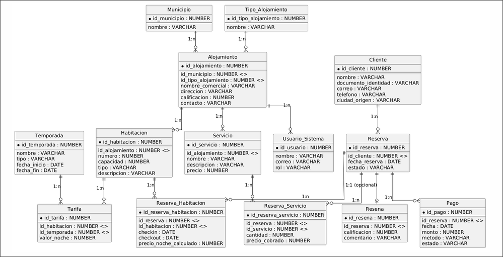

# TurismoUQ
## Entrega 1: Modelo de datos y decisiones de diseño

**Asignatura:** Bases de Datos II  
**Proyecto:** Plataforma de reservas turísticas del Quindío  
**Motor:** Oracle Database  
**Equipo:** Manuel Pineda Varela, Carlos Alonso Barahona y Santiago Solarte  
**Fecha de entrega:** 30 de septiembre de 2026

> [Nota de redacción: este documento corresponde a una versión preliminar basada únicamente en la información disponible en el repositorio y en los datos entregados por el equipo. Se recomienda revisar la redacción final una vez se consoliden los detalles definitivos del proyecto.]

---

## 1. Descripción del problema y alcance

TurismoUQ es una plataforma orientada a la gestión de la oferta turística de los 12 municipios del Quindío. El sistema contempla la administración de alojamientos, habitaciones, temporadas, tarifas, clientes, reservas, pagos, servicios complementarios y reseñas.

El modelo permite apoyar la consulta de ocupación por municipio y mes, la revisión de ingresos por alojamiento, tipo y temporada, la identificación de establecimientos con mayor rentabilidad y el análisis de variación mensual de los ingresos.

> [Nota de redacción: falta precisar la descripción final del problema en lenguaje institucional y ampliar la justificación estratégica del sistema si se requiere para la entrega final.]

---

## 2. Modelo entidad-relación

El modelo propuesto incluye las 14 entidades mínimas solicitadas para el proyecto:

- MUNICIPIO
- TIPO_ALOJAMIENTO
- ALOJAMIENTO
- HABITACION
- TEMPORADA
- TARIFA
- CLIENTE
- RESERVA
- RESERVA_HABITACION
- PAGO
- SERVICIO
- RESERVA_SERVICIO
- RESENA
- USUARIO_SISTEMA

### 2.1 Relaciones, cardinalidad y participación

| Relación | Cardinalidad | Participación | Descripción |
|---|---:|---|---|
| MUNICIPIO - ALOJAMIENTO | 1:N | ALOJAMIENTO total | Cada alojamiento pertenece a un municipio. Un municipio puede tener varios alojamientos. |
| TIPO_ALOJAMIENTO - ALOJAMIENTO | 1:N | ALOJAMIENTO total | Cada alojamiento tiene un tipo; un tipo puede clasificar varios alojamientos. |
| ALOJAMIENTO - HABITACION | 1:N | HABITACION total | Un alojamiento ofrece varias habitaciones y cada habitación pertenece a un alojamiento. |
| ALOJAMIENTO - SERVICIO | 1:N | SERVICIO total | Los servicios pertenecen al alojamiento que los ofrece. |
| ALOJAMIENTO - USUARIO_SISTEMA | 1:N | USUARIO_SISTEMA total | Un usuario encargado se asocia con el alojamiento que administra. |
| CLIENTE - RESERVA | 1:N | RESERVA total | Un cliente puede realizar varias reservas; cada reserva pertenece a un cliente. |
| HABITACION - TARIFA | 1:N | TARIFA total | Una habitación tiene una tarifa para cada temporada. |
| TEMPORADA - TARIFA | 1:N | TARIFA total | Una temporada define tarifas para varias habitaciones. |
| RESERVA - RESERVA_HABITACION | 1:N | RESERVA_HABITACION total | Una reserva puede incluir una o varias habitaciones. |
| HABITACION - RESERVA_HABITACION | 1:N | RESERVA_HABITACION total | Una habitación puede aparecer en muchas reservas en fechas diferentes. |
| RESERVA - RESERVA_SERVICIO | 1:N | RESERVA_SERVICIO total | Una reserva puede incluir varias líneas de servicios. |
| SERVICIO - RESERVA_SERVICIO | 1:N | RESERVA_SERVICIO total | Un servicio puede ser contratado en muchas reservas. |
| RESERVA - PAGO | 1:N | PAGO total | Una reserva puede pagarse mediante uno o varios abonos. |
| RESERVA - RESENA | 1:N | RESENA total | Una reseña se relaciona con la reserva que demuestra la estadía del cliente. |

Las relaciones de varios a varios del negocio se resuelven mediante entidades asociativas:

- RESERVA - HABITACION mediante RESERVA_HABITACION.
- RESERVA - SERVICIO mediante RESERVA_SERVICIO.
- HABITACION - TEMPORADA mediante TARIFA.

> [Nota de redacción: falta revisar la redacción final de la sección de cardinalidades para mantener un estilo uniforme con el resto del documento formal.]

---

## 3. Reglas de negocio derivadas

1. **Disponibilidad de habitaciones.** Una habitación no puede reservarse si existe otra reserva confirmada que se solape con el rango [checkin, checkout). Las fechas de entrada y salida de cada línea deben cumplir que checkin < checkout.

2. **Reserva de varias habitaciones.** Una reserva puede contener varias habitaciones, incluso del mismo alojamiento, cuando un grupo requiere espacios distintos dentro de la misma operación.

3. **No duplicidad de habitaciones.** Dos habitaciones del mismo alojamiento no pueden compartir el mismo número. La identificación del número de habitación es relevante dentro del contexto del alojamiento.

4. **Tarifa por temporada.** Cada combinación de habitación y temporada debe tener una tarifa nocturna. El valor no se calcula como un porcentaje fijo global, dado que cada alojamiento puede definir precios distintos.

5. **Estadías entre temporadas.** Una estadía que atraviesa dos o más temporadas debe calcularse noche por noche aplicando la tarifa vigente para cada fecha, en lugar de usar una sola tarifa para toda la reserva.

6. **Estados válidos de una reserva.** Una reserva solo puede tener los estados pendiente, confirmada, cancelada o completada.

7. **Pagos parciales.** Una reserva puede presentar varios pagos. Se considera pagada solo cuando la suma de los pagos exitosos cubre el valor de la estadía y los servicios contratados.

8. **Estados válidos de un pago.** Un pago solo puede estar en estado exitoso, fallido, pendiente o reembolsado.

9. **Cancelación y reembolso.** Si una reserva se cancela con más de cinco días de anticipación al check-in, el cliente tiene derecho al reembolso del 80 %. Con cinco días o menos no procede reembolso.

10. **Servicios propios del alojamiento.** Un servicio pertenece a un alojamiento específico. Dos servicios con el mismo nombre, pero ofrecidos por alojamientos distintos, son servicios diferentes.

11. **Cantidad de servicios.** Una línea de servicio puede solicitar varias unidades del mismo servicio. La cantidad debe ser positiva y su valor se suma al total de la reserva.

12. **Reseñas válidas.** Solo se puede registrar una reseña después de una estadía completada. La calificación debe estar entre 1 y 5 estrellas y la reseña debe corresponder a una reserva real del cliente.

13. **Usuarios internos.** Los usuarios del sistema deben tener un rol, como administrador o encargado. Un encargado administra la información del alojamiento al que está asociado.

14. **Asimetría de los datos.** Los alojamientos y habitaciones no se distribuyen de forma uniforme: los hoteles grandes tienen más habitaciones que las fincas pequeñas. Esto permite que los análisis de ocupación e ingresos representen situaciones reales.

> [Nota de redacción: falta revisar si todas las reglas deben quedar en una redacción final más breve o en formato de lista con mayor formalidad académica.]

---

## 4. Decisiones de diseño

### 4.1 Reserva de varias habitaciones

La relación entre RESERVA y HABITACION no se modela como una relación directa de uno a uno, porque un grupo puede reservar varias habitaciones dentro de una misma operación. Además, una habitación puede participar en diferentes reservas a lo largo del tiempo. Por ello, la relación de muchos a muchos se resuelve mediante la entidad asociativa RESERVA_HABITACION.

Esta tabla registra también el checkin, checkout y precio_noche_calculado para cada habitación reservada. La información por línea facilita representar grupos cuya llegada o salida ocurre en días distintos y permite validar la disponibilidad comparando rangos de fechas con las reservas confirmadas existentes.

La disponibilidad se determina revisando las reservas en estado confirmada y detectando solapamientos de fechas. De esa forma, una habitación puede estar en varias reservas históricas, siempre que los periodos no se superpongan cuando las reservas estén confirmadas.

### 4.2 Estadías que atraviesan temporadas

El precio de una habitación depende de la temporada y no existe una tarifa base única para todos los periodos. Por ello, se utiliza la entidad asociativa TARIFA, que relaciona cada HABITACION con cada TEMPORADA y almacena el valor de una noche para esa combinación.

Una estadía puede iniciar en una temporada y terminar en otra. Por ejemplo, una reserva del 20 al 26 de diciembre puede incluir noches de temporada media y noches de temporada alta. El valor correcto se obtiene recorriendo cada noche del intervalo, identificando la temporada vigente y sumando la tarifa correspondiente de la habitación para esa fecha.

El atributo precio_noche_calculado de RESERVA_HABITACION conserva el valor aplicado a la reserva. Este dato permite mantener el precio histórico utilizado en la operación, aunque las tarifas futuras sean modificadas. La función fn_valor_estadia, prevista para la Entrega 2, automatizará el cálculo para estadías que atraviesen una o varias temporadas.

> [Nota de redacción: falta definir si esta sección será ampliada con un ejemplo más formal o se dejará en la versión actual según las decisiones planteadas.]

---

## 5. Implementación física

El modelo físico se implementa en Oracle con los siguientes elementos básicos:

- Claves primarias para identificar cada registro.
- Claves foráneas para mantener la integridad referencial.
- Restricciones NOT NULL para datos obligatorios.
- Restricciones CHECK para estados, tipos, métodos de pago y rangos de fechas.
- Restricciones UNIQUE para documentos de identidad.
- Columnas IDENTITY para generar identificadores automáticamente.

Archivos incluidos en el repositorio:

- [ScriptDDL.sql](ScriptDDL.sql): creación de tablas y restricciones.
- [ScriptDatos.sql](ScriptDatos.sql): generación de datos mediante PL/SQL.
- [diagrama.png](diagrama.png): imagen del modelo entidad-relación.

> [Nota de redacción: falta confirmar si se incluirán descripciones adicionales del contenido de los scripts en la versión final del documento.]

---

## 6. Volumen de datos generado

El script de carga está preparado para generar los volúmenes mínimos solicitados:

| Tabla | Volumen esperado |
|---|---:|
| MUNICIPIO | 12 |
| TIPO_ALOJAMIENTO | 4 |
| ALOJAMIENTO | 60 |
| HABITACION | 400 |
| TEMPORADA | 6 |
| TARIFA | 2.400 |
| CLIENTE | 3.000 |
| RESERVA | 25.000 |
| RESERVA_HABITACION | 30.000 |
| PAGO | 25.000 |
| SERVICIO | 30 |
| RESERVA_SERVICIO | 40.000 |
| RESENA | 10.000 |
| USUARIO_SISTEMA | 10 |

Los datos se distribuyen de forma desigual entre alojamientos, municipios y habitaciones para que las consultas analíticas reflejen situaciones reales del mercado.

> [Nota de redacción: falta definir si esta sección será acompañada por una justificación adicional del diseño de carga y del volumen propuesto.]

---

## 7. Lista de verificación de la Entrega 1

- [x] Modelo entidad-relación con las 14 entidades.
- [x] Cardinalidad y participación descritas.
- [x] Mínimo de seis reglas de negocio derivadas.
- [x] Explicación de las dos decisiones de diseño principales.
- [x] Script DDL con tablas y restricciones.
- [x] Script PL/SQL de carga de datos.
- [ ] Script independiente con las siete consultas analíticas solicitadas: PIVOT, ROLLUP o CUBE con GROUPING, RANK, LAG, variables de enlace, UNPIVOT y consulta libre.

> [Nota de redacción: falta completar la redacción final de la última sección una vez se confirme el estado definitivo de la entrega y las consultas analíticas pendientes.]

---

## 8. Observaciones pendientes para la redacción final

- Confirmar el texto definitivo del nombre del proyecto y del alcance institucional del documento.
- Revisar la redacción de las secciones para que el tono sea consistente con un informe formal.
- Definir si se incluirán anexos, tablas adicionales o explicaciones complementarias.
- Confirmar la versión final de la entrega antes de la presentación formal.
- Completar la parte de consultas analíticas pendientes, si corresponde a la entrega final del proyecto.

> [Nota final: este documento se mantiene en una versión preliminar y debe ser revisado antes de entregarse como versión definitiva.]